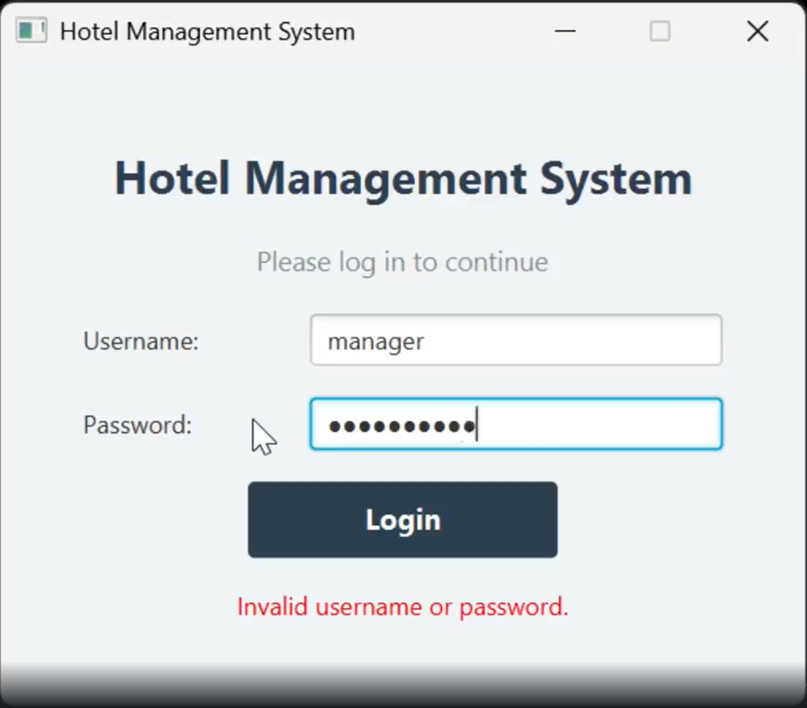
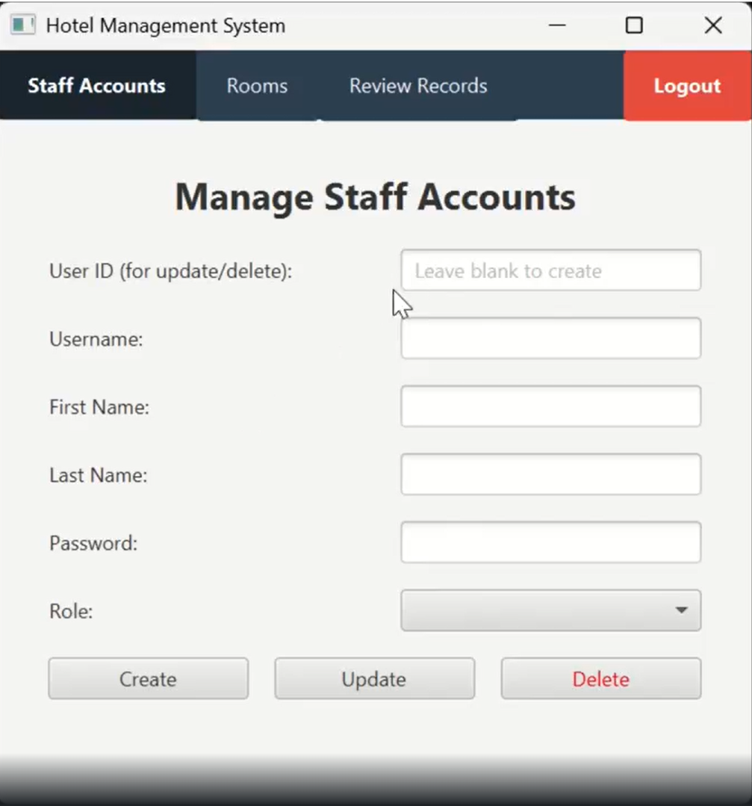
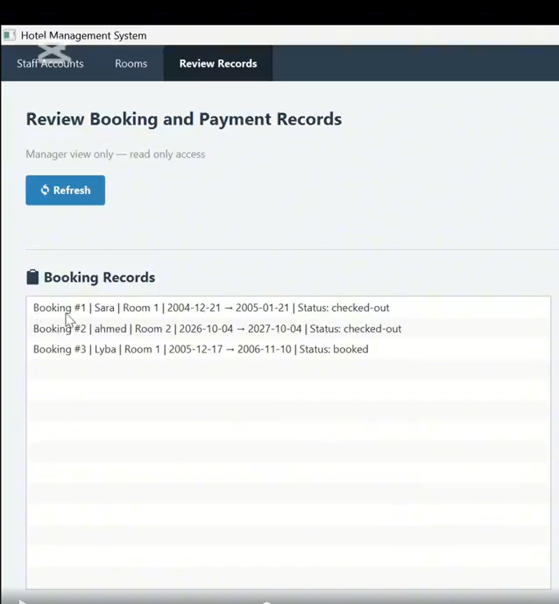
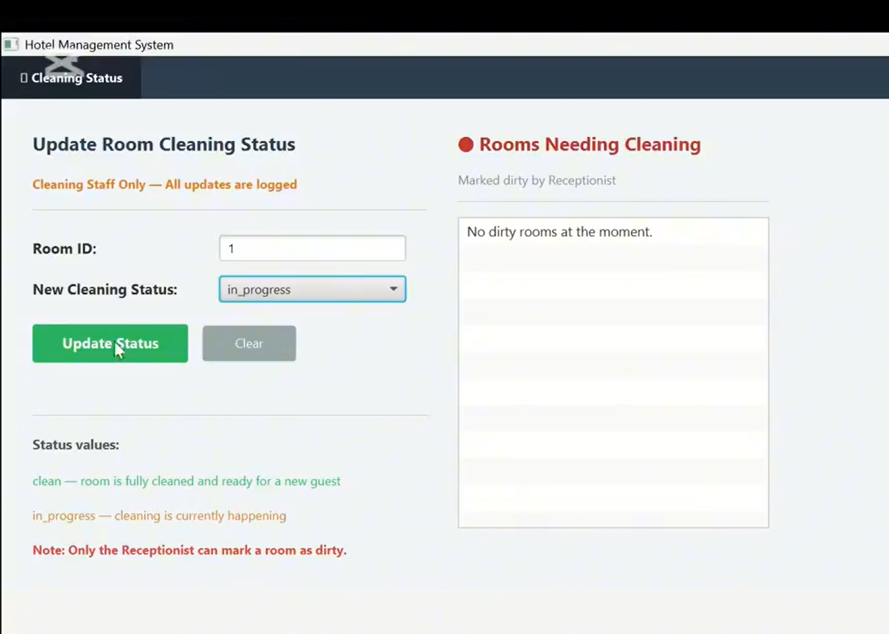

<div align="center">

# 🏨 Hotel Management System

### *Secure • Full-Featured • Role-Based*

[](https://openjdk.org/)
[](https://openjfx.io/)
[](https://www.mysql.com/)
[](https://en.wikipedia.org/wiki/Bcrypt)
[]()
[]()

<br/>

> *A production-grade desktop application demonstrating end-to-end secure software development —*
> *from threat modeling with STRIDE/DREAD to a fully layered MVC implementation.*

</div>

---

## 📸 Preview

<div align="center">

| 🔐 Login Screen | 👥 Staff Management |
|:-:|:-:|
|  |  |

| 📋 Booking View | 🛏️ Room Cleaning Status |
|:-:|:-:|
|  |  |

</div>

---

## ✨ Features

<table>
<tr>
<td width="50%">

### 🔐 Security First
- **BCrypt** password hashing (cost factor 12)
- **PreparedStatements** — SQL injection proof
- **RBAC** enforced at the business layer
- **Audit logging** for all sensitive actions
- Generic error messages to prevent data leaks

</td>
<td width="50%">

### 🏗️ Clean Architecture
- Full **MVC** — model, service, DAO, UI layers
- Role-separated scenes (Manager / Receptionist / Cleaning Staff)
- Business logic fully decoupled from persistence
- JavaFX FXML-based scene navigation

</td>
</tr>
<tr>
<td>

### 📋 Booking & Operations
- Create, update & search bookings
- Real-time room availability tracking
- Automatic room status on check-in/out
- Payment simulation with cost calculation

</td>
<td>

### 👥 Staff & Access Control
- Role-based login (3 roles)
- Managers can create/update/delete accounts
- Cleaning staff get live room assignment feeds
- Every role sees only its permitted screens

</td>
</tr>
</table>

---

## 🏛️ Architecture

```
┌──────────────────────────────────────────────────┐
│              Presentation Layer (ui/)             │
│   JavaFX FXML Controllers per Role               │
│   Manager  │  Receptionist  │  Cleaning Staff    │
└────────────────────┬─────────────────────────────┘
                     │
┌────────────────────▼─────────────────────────────┐
│              Business Layer (service/)            │
│   BookingService │ RoomService │ AuthService      │
│   Input Validation │ RBAC Enforcement             │
└────────────────────┬─────────────────────────────┘
                     │
┌────────────────────▼─────────────────────────────┐
│              Persistence Layer (dao/)             │
│   BookingDAO │ RoomDAO │ UserDAO                  │
│   PaymentDAO │ AuditLogDAO                        │
│   JDBC + PreparedStatements                       │
└────────────────────┬─────────────────────────────┘
                     │
┌────────────────────▼─────────────────────────────┐
│                  MySQL 8.0                        │
│   users │ rooms │ bookings │ payments │ audit_logs│
└──────────────────────────────────────────────────┘
```

---

## 🔒 Security Design

| Threat | Mitigation |
|--------|------------|
| Weak Passwords | BCrypt hashing ($2a$, cost factor 12) |
| SQL Injection | PreparedStatements throughout all DAOs |
| Unauthorized Access | Role-based access control (RBAC) |
| Privilege Escalation | Business-layer role enforcement |
| Data Leakage | Generic error responses only |
| Accountability | Audit log on all sensitive actions |

> Threat modeling performed using **STRIDE** and **DREAD** frameworks.
> Dynamic testing via **DAST** applied during validation phase.

---

## 🗄️ Database Schema

```sql
users       → userId, username, passwordHash, role, firstName, lastName
rooms       → roomId, roomNumber, roomType, rate, status, cleaningStatus
bookings    → bookingId, guestName, guestPhone, roomId, checkIn, checkOut, status
payments    → paymentId, bookingId, amount, method, timestamp, status
audit_logs  → logId, userId, action, details, timestamp
```

**Room statuses:** `available` · `occupied` · `reserved`

**Booking statuses:** `booked` · `checked-in` · `checked-out` · `cancelled`

**Cleaning statuses:** `clean` · `dirty` · `in_progress`

---

## 📂 Project Structure

```
SSD-Project/
├── src/
│   ├── dao/
│   │   ├── AuditLogDAO.java
│   │   ├── BookingDAO.java
│   │   ├── PaymentDAO.java
│   │   ├── RoomDAO.java
│   │   └── UserDAO.java
│   ├── model/
│   │   ├── Booking.java
│   │   ├── Payment.java
│   │   ├── Room.java
│   │   └── User.java
│   ├── service/
│   ├── ui/
│   ├── util/
│   ├── config.properties
│   └── Main.java
├── libs/
├── database.sql
└── .gitignore
```

---

## 🚀 Getting Started

### Prerequisites

```
Java 17+
JavaFX SDK 17+
MySQL 8.0+
IntelliJ IDEA (recommended)
```

### Setup

```bash
git clone https://github.com/Lybaqadir/SSD-Project.git
cd SSD-Project
mysql -u root -p < database.sql
```

---

## 👥 Team

<div align="center">

| | Name | Role |
|:-:|------|------|
| 👩‍💻 | **Lyba Qadir** | Software Engineer |
| 👩‍💻 | **Noora Al-Hajri** | Cyber Security |
| 👩‍💻 | **Aljory Almannai** | Cyber Security |

*Built for **Secure Software Development Course Project***

*University of Doha for Science and Technology · 2026*

</div>

---

## 🛠️ Tech Stack

```
Language        →  Java 17
UI Framework    →  JavaFX (FXML + Controllers)
Database        →  MySQL 8.0
ORM / Access    →  JDBC + PreparedStatements
Security        →  jBCrypt, RBAC, Audit Logging
IDE             →  IntelliJ IDEA
Threat Modeling →  STRIDE / DREAD
Testing         →  DAST
Diagrams        →  UML
```

---

<div align="center">

*Made with ☕ Java and a lot of 🔒 security thinking*

</div>
